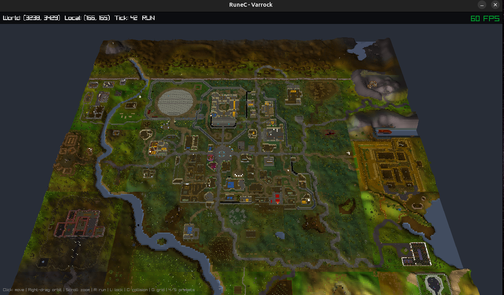

# RuneC



RuneC is a C implementation of Old School RuneScape systems with two
primary goals:

- Run as a playable OSRS-style game through a Raylib viewer.
- Run headlessly as a fast, modular simulation backend for RL training
  and evaluation.

The same backend powers both use cases. A full game build can load the
world, renderer, data, UI-facing state, combat, skills, items, NPCs,
and encounters. A focused simulation can enable only the systems needed
for a task, such as movement + combat + equipment + prayer + one boss
arena, or movement + tools + inventory + one skilling loop.

The current viewer renders the Varrock area with terrain, buildings,
objects, animated NPCs, animated player movement, and tile collision
from OSRS cache-derived data. The engine includes modular subsystem
loading, OSRS-style combat math, data-backed items/NPCs/drops, and a
boss encounter pipeline.

## Architecture

```
rc-core/      Generic game engine (pure C, no render deps).
              Tick loop, pathfinding, combat, prayer, skills, items,
              object interaction, traversal, data loading, encounter
              subsystem, event bus. Content-agnostic: no boss-specific
              or renderer-specific logic belongs here.

rc-content/   OSRS-specific content modules.
              Encounter scripts, region behavior, and other content
              that should stay outside the generic engine.

rc-viewer/    Raylib frontend.
              3D rendering, camera, input, asset loading, animation.

tools/        Python data/export utilities.
              Used to produce compact runtime datasets from OSRS
              reference data and curated content definitions.

data/         Runtime data and curated content definitions.
              regions/ (per-region terrain/objects/collision),
              defs/ (NPCs, items, drops, encounters, etc.),
              curated/ (hand-authored content definitions).
```

The backend exposes a small C API centered on world creation, ticks,
and queued player inputs. The viewer reads state from the backend each
frame. Simulation targets can skip the viewer entirely and run only the
subsystems needed for the task.

## Current State

**World + Rendering:**
- 25-region Varrock world (320x320 tiles) with terrain, buildings, trees, objects
- 79 Varrock NPC types rendering with stand/walk animations
- Player model with idle/walk/run animations
- Click-to-move with BFS pathfinding (respects directional collision flags)
- Orbit camera with zoom, follow mode, presets

**Game Engine:**
- Subsystem-based architecture with runtime bitmask toggles (combat,
  prayer, equipment, inventory, consumables, loot, skills, quests,
  dialogue, shops, storage, traversal, objects, regions, slayer,
  encounters)
- Combat engine with OSRS DPS formulas (melee/ranged/magic accuracy +
  max hit), protection prayers, pending-hit queue with prayer snapshot
- Encounter subsystem: 50 boss specs in a curated-data to binary to
  registry pipeline; event-driven lifecycle; phase transitions;
  periodic, attack-count, and event-driven mechanic dispatch
- NPC wander AI, respawn, deterministic XORshift32 RNG

**Data Pipeline:**
- Compiled datasets currently include NPC definitions, items, varbits,
  varps, drops, acquisition sources, shops, recipes,
  spells, prayers, quests, dialogue, slayer data, encounters, object
  definitions, object placements, traversal edges, collision, area
  flags, and world/activity spawns.
- Runtime render data includes regions, models, animations, collision,
  object placement, and NPC placement data.
- Runtime data is modular: disabled subsystems do not load their owned
  datasets.

**Tests:** use CTest for the built test suite.

## Build

Use an out-of-tree build. `RelWithDebInfo` is a good default for
development; use `Release` when benchmarking.

```bash
cmake -S . -B /tmp/runec_build -DCMAKE_BUILD_TYPE=RelWithDebInfo
cmake --build /tmp/runec_build -j"$(nproc)"
```

Run the viewer:

```bash
/tmp/runec_build/rc-viewer
```

Run tests:

```bash
ctest --test-dir /tmp/runec_build --output-on-failure
```

Requires CMake 3.20+, a C11 compiler, Raylib 5.5 (prebuilt in
`lib/raylib/`), Python 3.10+ (for tools only, not runtime).

## Using The Engine

Create a world from a preset, tick it, and queue player actions through
the public API:

```c
RcWorldConfig cfg = rc_preset_combat_only();
RcWorld *world = rc_world_create_config(&cfg);

rc_player_walk_to(world, 3222, 3218);
rc_world_tick(world);

rc_world_destroy(world);
```

Common presets:

```c
rc_preset_full_game();      // all gameplay systems
rc_preset_combat_only();    // movement + combat-focused simulation
rc_preset_skilling_only();  // movement + inventory/equipment + skills
rc_preset_base_only();      // minimal movement/tick baseline
```

## References

**Built with:**
- [Raylib 5.5](https://www.raylib.com/) — rendering, input, windowing
- C11 / CMake — build system
- Python 3 — data-pipeline scripts

**OSRS data and behavior references:**
- [OpenRS2](https://archive.openrs2.org/) — OSRS cache archives (b237)
- [RuneLite](https://github.com/runelite/runelite) — cache format, collision flags, coordinate system, item/NPC/object definitions
- [RSMod](https://github.com/rsmod/rsmod) — tick processing order, BFS pathfinding, combat accuracy formulas, collision system (OSRS-accurate)
- [Void RSPS](https://github.com/GregHib/void) — skill implementations, Varrock content, object interactions (pre-2013 RS — overlap source only)
- [osrsreboxed-db](https://github.com/0xNeffarion/osrsreboxed-db) — item equipment bonuses, NPC combat stats, aggression
- [OSRS Wiki](https://oldschool.runescape.wiki/) — authoritative for all OSRS content (drop tables, mechanics, quests)
- [runescape-rl](https://github.com/jbaileydev/runescape-rl) — earlier Fight Caves C implementation

## License

This project is for educational and research purposes. OSRS content and cache data belong to Jagex Ltd.
