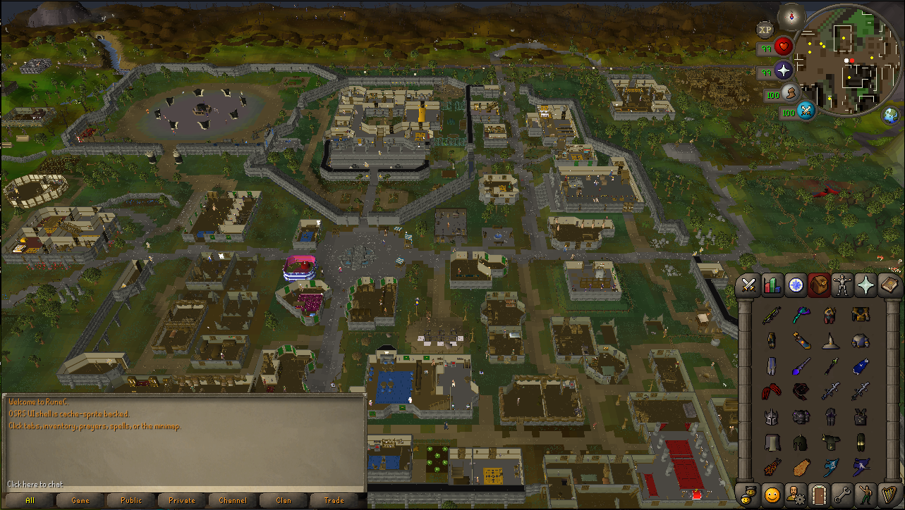
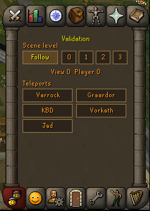
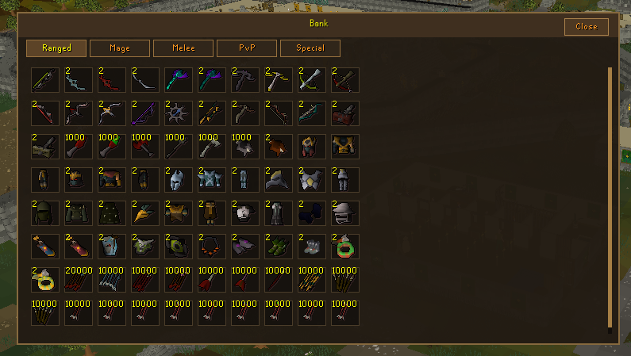

# RuneC

RuneC is a local C implementation of Old School RuneScape-style gameplay. It
currently runs as a playable desktop viewer and uses the same backend for
deterministic headless simulation.

The goal is simple: make an OSRS-like game that can be played locally, tested
quickly, and reused for fast simulation workloads without needing a live server.

## Features

RuneC currently includes:

- a playable local world slice with cache-backed terrain, objects, collision,
  models, textures, sprites, fonts, animations, and NPC spawns
- an OSRS-style fixed gameframe with inventory, equipment, combat styles,
  prayer, spellbook, chatbox, minimap, orbs, tabs, and context menus
- click-to-walk, right-click camera panning, middle-click context menus, and a
  top-left hover label showing the current left-click action
- doors, gates, ladders, stairs, caves, portals, manholes, object transports,
  and plane changes for tested areas
- player, NPC, equipment, projectile, object, and item rendering from the local
  cache/data pipeline
- inventory, equipment, bank/storage, spell selection, rune checks, ranged and
  magic projectile foundations, and combat validation helpers
- a modular C backend intended for both playable runs and fast headless
  simulation

## Dependencies

The current clone-and-run path is tested on Linux.

On Ubuntu/Debian:

```bash
sudo apt update
sudo apt install git build-essential cmake python3 curl zlib1g-dev libgl1-mesa-dev
```

You also need Bash, `sha256sum`, and a working desktop/OpenGL environment to
run the Raylib viewer. Raylib itself is vendored in `lib/raylib/`, so normal
builds do not require a separate Raylib install.

## Quick Start

```bash
git clone https://github.com/jordanbailey00/RuneC.git
cd RuneC
python3 tools/data_pipeline.py pack-runtime-data
./scripts/setup-data.sh --offline dist-data
cmake -S . -B build -DCMAKE_BUILD_TYPE=RelWithDebInfo
cmake --build build --parallel
./build/rc-viewer
```

`runtime-data.lock` is currently a draft pointer because the data-v1 release
gate still has source-authority gaps. Until an official runtime-data release is
recorded there, `./scripts/setup-data.sh` intentionally refuses a default remote
download. Maintainer/dev checkouts should generate `dist-data/` locally and
install from it with `--offline`.

## Validation Tools

RuneC includes temporary in-game validation tools so combat, movement, planes,
and asset rendering can be tested without running across the world.



Open the Clan Chat side tab to use the validation panel:

- `Follow` returns the scene view to the player's current plane.
- `0`, `1`, `2`, and `3` force the viewer to inspect a specific scene level.
- `Varrock`, `Graardor`, `KBD`, `Vorkath`, and `Jad` move the player to common
  validation locations.

These helpers are for development and testing. To run without them:

```bash
RUNEC_DEV_VALIDATION=0 ./build/rc-viewer
```

You can also start directly at a validation destination:

```bash
RUNEC_DEV_TRANSPORT_DEST=graardor ./build/rc-viewer
```

## Validation Bank

The Varrock bank is seeded with high-level gear and supplies for combat testing.



The bank is split into simple testing tabs:

- `Ranged`
- `Mage`
- `Melee`
- `PvP`
- `Special`

It includes weapons, armor, ammunition, runes, capes, offhands, jewelry, and
other items used to validate combat animations, projectiles, equipment models,
special attacks, and item behavior. Stackable supplies are loaded in bulk, and
withdrawals leave one copy behind so the bank order stays stable while testing.

The Varrock-bank combat dummy is also temporary validation content. Disable just
the dummy with:

```bash
RUNEC_DEV_BANK_DUMMY=0 ./build/rc-viewer
```

## Current Status

RuneC is still in active development. The current build is good for local
exploration, UI validation, combat visual testing, object/transport testing,
and backend regression work. Some game systems and content are still incomplete,
including full combat parity, all special attacks, full boss behavior, exact
minimap parity, and long-tail item/object edge cases.

## Repository Layout

```text
rc-core/       Headless C game engine. Tick loop, pathfinding, combat,
               inventory, equipment, objects, traversal, data loading, and
               subsystem state. No rendering or OSRS-specific content.

rc-content/    OSRS-specific content hooks. Boss scripts, quest state machines,
               and region-specific behavior that sits on top of rc-core.

rc-viewer/     Raylib frontend. Rendering, camera, input translation, UI,
               animation playback, and presentation-only state.

tools/         Python data tooling for packing, unpacking, validating, and
               exporting runtime assets.

tests/         C runtime tests, regression tests, and benchmark helpers.

data/          Local runtime data install populated by scripts/setup-data.sh.
               This directory is ignored by Git.
```

## Data Setup

RuneC does not track generated runtime data in Git. Run this once after cloning:

```bash
python3 tools/data_pipeline.py pack-runtime-data
./scripts/setup-data.sh --offline dist-data
```

This installs:

```text
data/
  manifest.json
  packs/
    *.pak
  defs/
  models/
  regions/
  sprites/
  fonts/
  ui/
```

Once `runtime-data.lock` points to an official release, `./scripts/setup-data.sh`
will download the locked manifest and packs by default. While the lock remains
draft, use `--offline dist-data` or explicit `RUNEC_DATA_BASE_URL` /
`RUNEC_DATA_MANIFEST_URL` overrides. The script expands packs into loose local
runtime files so the viewer uses the fast file-loading path. Set
`RUNEC_DATA_UNPACK=0` to keep only the manifest and packs, or
`RUNEC_DATA_UNPACK_FORCE=1` to rewrite already extracted files.

Runtime asset loading supports both loose files and release packs. The default
backend is `auto`: loose `data/...` files are used when present, otherwise
`data/packs/*.pak` is used. Override with `RUNEC_ASSET_BACKEND=loose` or
`RUNEC_ASSET_BACKEND=pack`. Runtime startup validates `data/manifest.json`
before creating a world and reports missing required data paths as startup
errors.

Headless environments can verify viewer startup without opening a window:

```bash
RUNEC_VIEWER_SMOKE=1 RUNEC_ASSET_BACKEND=pack ./build/rc-viewer
RUNEC_VIEWER_SMOKE=1 RUNEC_ASSET_BACKEND=loose ./build/rc-viewer
```

## Build

Build out of tree:

```bash
cmake -S . -B build -DCMAKE_BUILD_TYPE=RelWithDebInfo
cmake --build build --parallel
```

Run the viewer:

```bash
./build/rc-viewer
```

Run tests:

```bash
ctest --test-dir build --output-on-failure
```

Data maintainers can rebuild release packs from loose `data/` with:

```bash
./tools/pack_runtime_data.py --dry-run --version v1
./tools/pack_runtime_data.py --version v1 --output dist-data --force
```

Run the SPS benchmark:

```bash
bash tests/benchmarks/run_sps_benchmark.sh
```

## Engine API

`rc-core` exposes a small C API centered on world creation, queued player
intent, and deterministic ticks:

```c
RcWorldConfig cfg = rc_preset_combat_only();
RcWorld *world = rc_world_create_config(&cfg);

rc_player_walk_to(world, 3222, 3218);
rc_world_tick(world);

rc_world_destroy(world);
```

Useful presets:

```c
rc_preset_full_game();      // all gameplay systems
rc_preset_combat_only();    // movement + combat-focused simulation
rc_preset_skilling_only();  // movement + inventory/equipment + skills
rc_preset_base_only();      // minimal movement/tick baseline
```

## Architecture Boundaries

- `rc-core` owns gameplay state and rules.
- `rc-content` owns OSRS-specific content hooks and scripts.
- `rc-viewer` owns rendering, UI presentation, camera, animation playback, and
  input-intent translation.
- `tools/` owns export-time cache/data conversion and runtime pack creation.
- `data/` is local-only runtime/data-factory output.

Gameplay rules should not live in the viewer. Cache decoding should not happen
inside the runtime tick path. Generated data should not be committed to the
RuneC repository.

## References

RuneC uses local reference checkouts for audit and parity research. The runtime
does not call those projects.

- [OpenRS2](https://archive.openrs2.org/) for OSRS cache archives
- [RuneLite](https://github.com/runelite/runelite) for cache/client behavior
  reference
- [RSMod](https://github.com/rsmod/rsmod) for OSRS server behavior reference
- [OSRS Wiki](https://oldschool.runescape.wiki/) for content facts and
  mechanics

Private-server and wrong-game sources are not accepted as RuneC data
authority. Missing facts should be tracked as source gaps until backed by the
b237 cache/dumps, RuneLite, RSMod, OSRS Wiki, or reviewed authored content.

## License

RuneC is for educational and research purposes. Old School RuneScape content,
cache data, names, and assets belong to Jagex Ltd.
